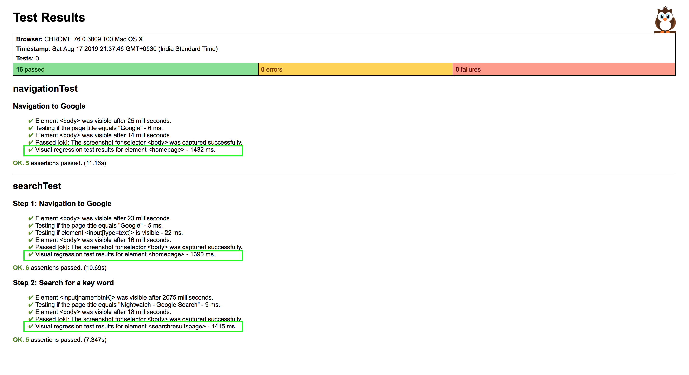

# nightwatch-vrt

### Waht is in here ?

A sample nightwatch project to run your ` visual regression tests ` programmatically.

This project is extending my [nightwatch-poc](https://github.com/NageshJoy007/nightwatch-poc) project with vrt capabilities.

### Setup 

* Install node via `  $ brew install node  ` Or download [Node.js](https://nodejs.org/en/download/)

* Do  `  $ git clone https://github.com/NageshJoy007/nightwatch-poc.git  `

* To download required node_modules specified in [package.json](./package.json)  `npm install`

### Run

Go into project folder and run below commands:

1) To run your tests

   ` $ npm test `      Or       ` $ nightwatch ./tests  `

2) To run and compare your tests with full page screenshots

    - Added a util for resizeWindow to pageScrollWidth, pageScrollHeight.
    
    - Added `chrome-headless` configuration to [nightwatch.conf.js](./nightwatch.conf.js) to support full page screenshot.

   ` $ nightwatch ./tests -e chrome-headless `

### Output

* Visual regression test resulting screens will be captured in ` vrt ` folder

    - Benchmark screenshots will be created on your first test run in ` baseline ` folder

    - Latest/recent test run screenshots will be captured in ` latest ` folder

    - Differance between ` baseline ` and ` latest ` screenshots will be captured in ` diff ` folder

* Reports will generate under tests_output folder

